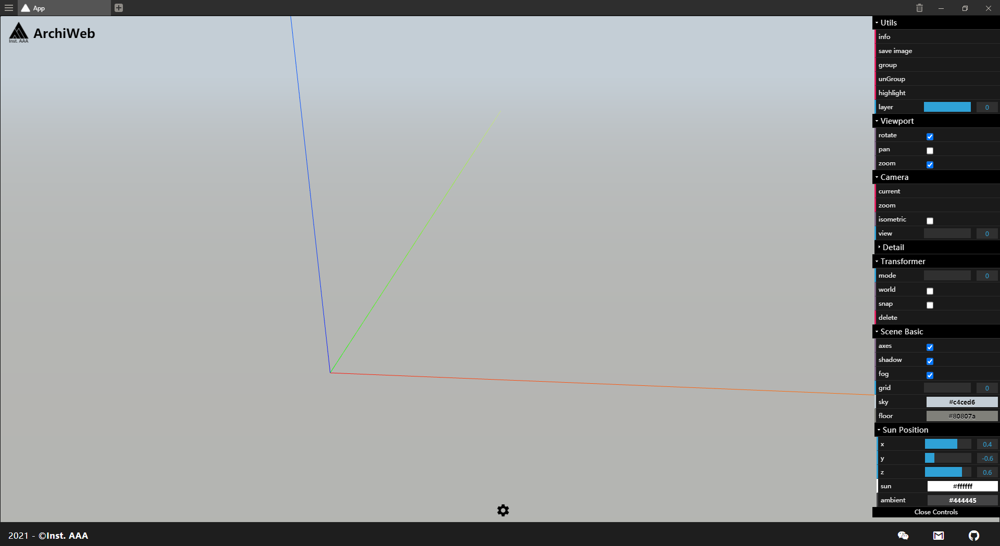
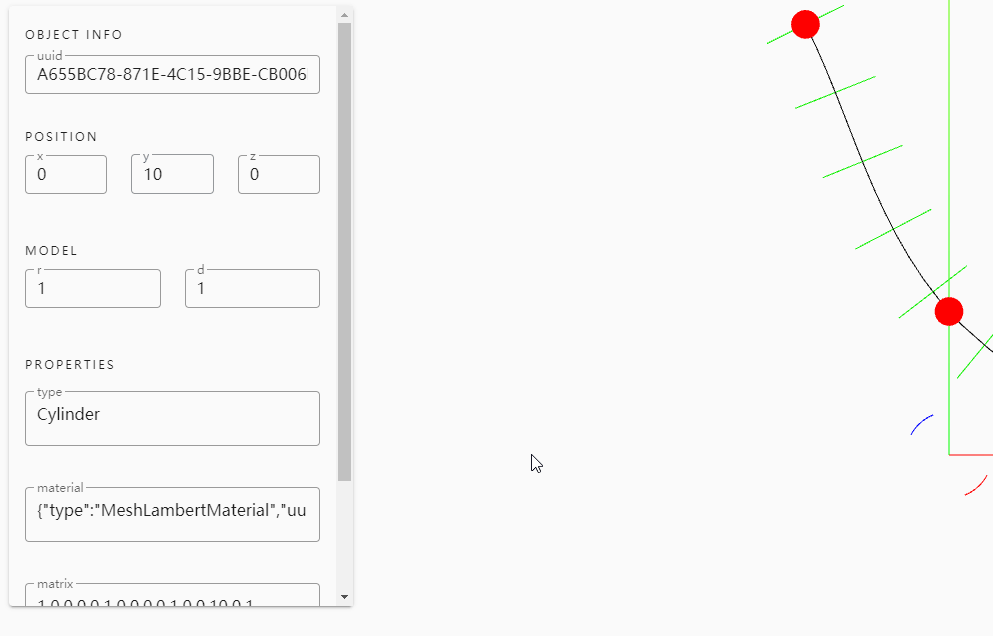
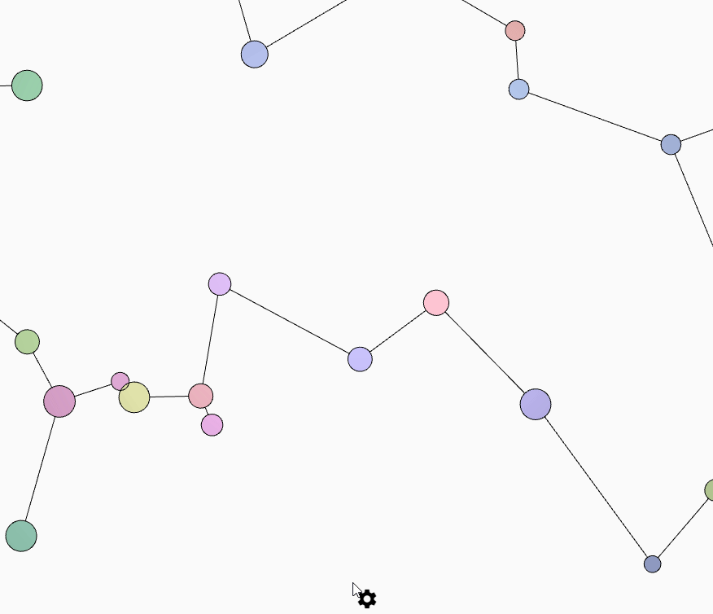
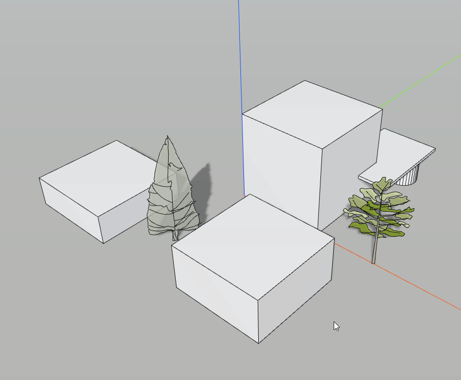
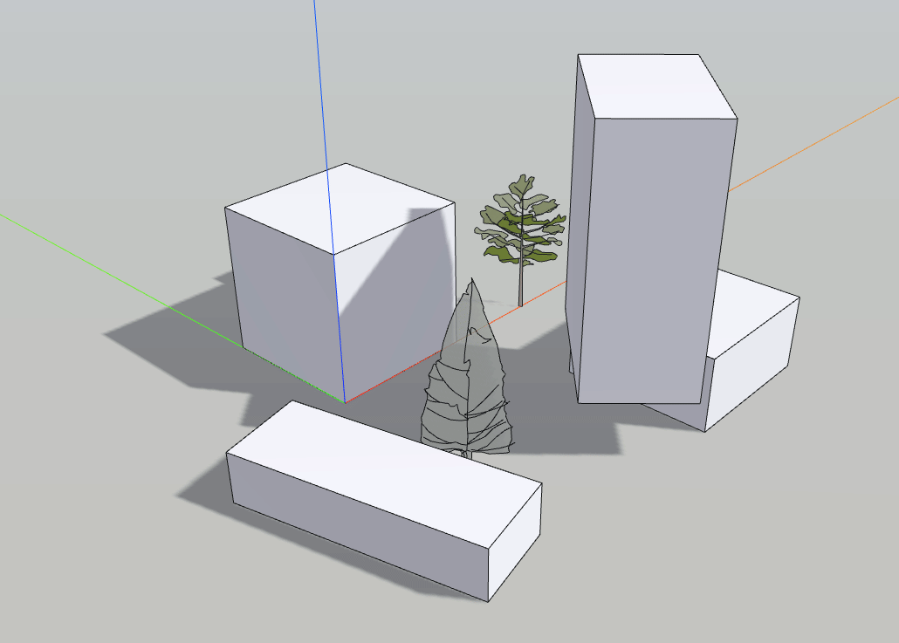
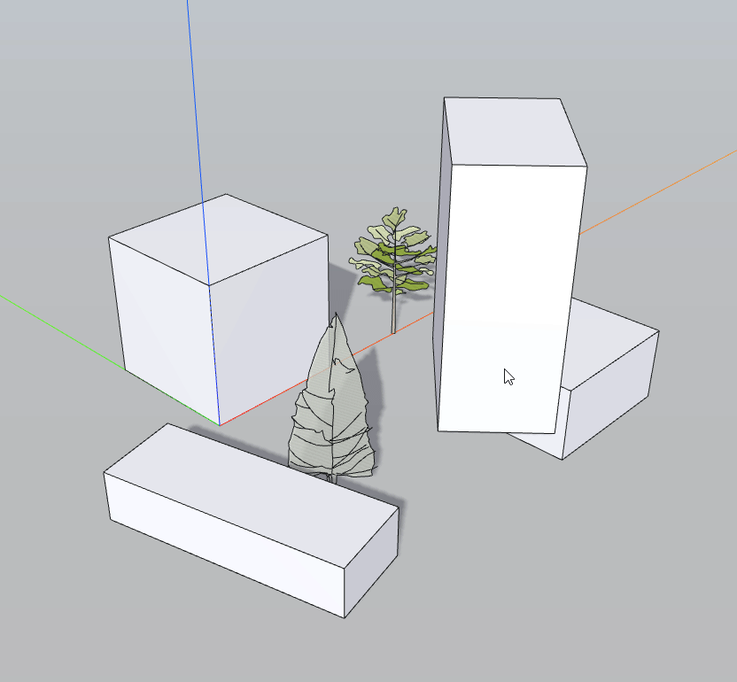
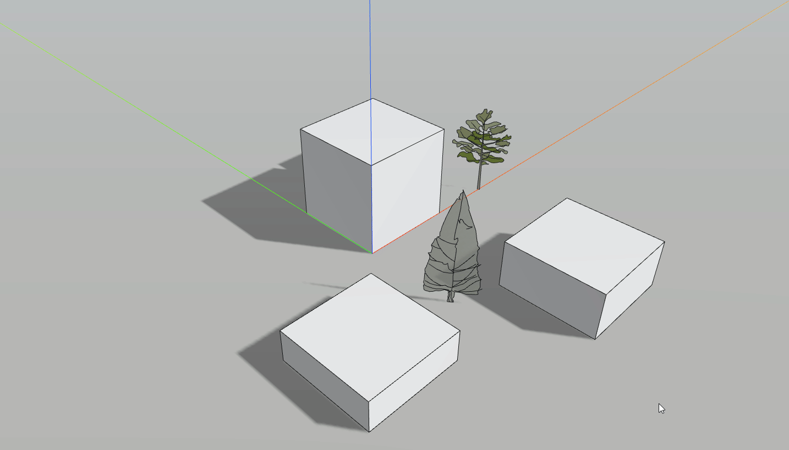
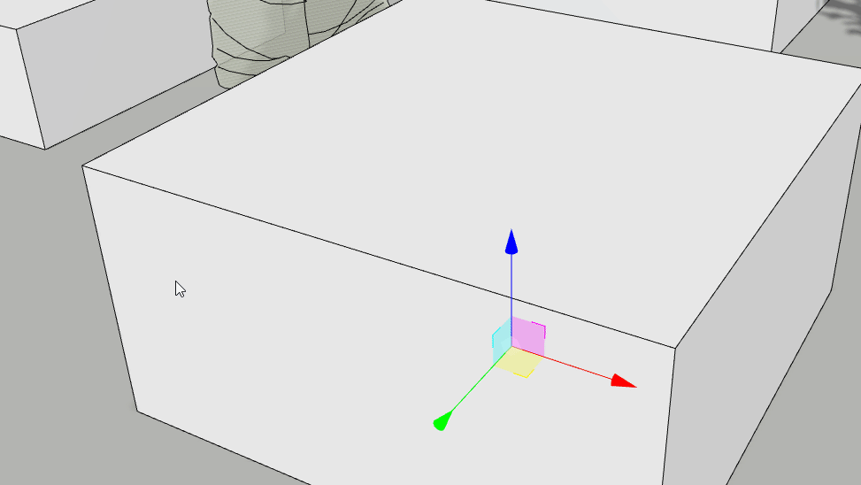

```
      ___         ___         ___         ___                   ___         ___         ___     
     /\  \       /\  \       /\  \       /\__\        ___      /\__\       /\  \       /\  \    
    /::\  \     /::\  \     /::\  \     /:/  /       /\  \    /:/ _/_     /::\  \     /::\  \   
   /:/\:\  \   /:/\:\  \   /:/\:\  \   /:/__/        \:\  \  /:/ /\__\   /:/\:\  \   /:/\:\  \  
  /::\~\:\  \ /::\~\:\  \ /:/  \:\  \ /::\  \ ___    /::\__\/:/ /:/ _/_ /::\~\:\  \ /::\~\:\__\ 
 /:/\:\ \:\__/:/\:\ \:\__/:/__/ \:\__/:/\:\  /\__\__/:/\/__/:/_/:/ /\__/:/\:\ \:\__/:/\:\ \:|__|
 \/__\:\/:/  \/_|::\/:/  \:\  \  \/__\/__\:\/:/  /\/:/  /  \:\/:/ /:/  \:\~\:\ \/__\:\~\:\/:/  /
      \::/  /   |:|::/  / \:\  \          \::/  /\::/__/    \::/_/:/  / \:\ \:\__\  \:\ \::/  / 
      /:/  /    |:|\/__/   \:\  \         /:/  /  \:\__\     \:\/:/  /   \:\ \/__/   \:\/:/  /  
     /:/  /     |:|  |      \:\__\       /:/  /    \/__/      \::/  /     \:\__\      \::/__/   
     \/__/       \|__|       \/__/       \/__/                 \/__/       \/__/       ~~       

```

[](https://github.com/Inst-AAA/archiweb/tags)
[](https://github.com/Inst-AAA/archiweb/archive/master.zip)

[](LICENSE) 

ArchiWeb is a front-end web application using [Vuetify](https://vuetifyjs.com/en/) and [three.js](https://threejs.org/). It's recommanded to start from the documentations of both.
## Usage
ArchiWeb provides a template to create a web application from scratch, you can easily use [Vuetify UI components](https://vuetifyjs.com/en/components/buttons/) to generate a material design web, also with 3d rendering.

### Environment
- Node 12.x
- Java 8 (for Processing)

### Installation
``` bash
git clone https://github.com/Inst-AAA/archiweb.git
cd archiweb/front-end

# install dependencies
npm install

# run server
npm run serve
```

### Template
ArchiWeb is under developing, so it's recommanded to `Use this template` creating your own repository from ArchiWeb and receiving updates by merging the upstream.
``` bash
# clone
git clone git@github.com:Your/new-repo.git

cd archiweb/front-end
npm run serve


# Update with upstream
# add as remote 
git remote add upstream git@github.com:Inst-AAA/archiweb.git
git fetch upstream

# Important: 
# don't merge on your default branch (main or master)
git checkout -b dev
# merge
git merge upstream/main --allow-unrelated-histories

# update submodule
# first time
git submodule update --init --recursive 
# later
cd plugins/archijson
git checkout main
git pull origin main

```
We also provide [archiweb-java-template](https://github.com/Inst-AAA/archiweb-java-template), which uses archiweb as a submodule.


### Quick start example

After `npm run serve`, ArchiWeb opens a viewer from `index.js`. 

``` javascript
// file: front-end/src/index.js

/* ---------- create your scene object ---------- */
function initScene() {
  gf = new ARCH.GeometryFactory(scene);
  mt = new ARCH.MaterialFactory();
  
  // create a box with phong material
  let b = gf.Cuboid([0, 0, 0], [100, 100, 100], mt.Matte());
}
```
The example files are in the folder `src/examples`, you can access by clicking on ArchiWeb at top bar.
### Tools
#### GUI
##### dat.gui
ArchiWeb provides user a dat.gui entry. It's very simple to use;
- `gui.gui` is the root folder
- `gui.util` is the **util folder** at the top of controllers
##### InfoCard:

##### Notification:
comming soon...
##### OptionCard:
You can write about the infomation and hotkeys of your application in the option card.
The card can be open by clicking on the cog button.


#### Transformer
Transform tool derive from THREE.TransformControl, just like Rhino Gumball


#### SceneBasic
SceneBasic creates a basic architectural design environment, with ground, sky and fog.


#### DragFrames
Multiselect tools


#### MultiCamera
Similar to SketchUp, you can use perspective camera and orthographic camera in the scene, and switch between them use hotkeys
##### multiple view
press `C` to toggle between perspective and orthographic camera, view change hotkeys: `1-9`


##### zoom to object

#### GeometryFactory
This function provides basic [BufferGeometry](https://threejs.org/docs/index.html#api/en/core/BufferGeometry) prefered by architectural usage.

Create mesh with buffer geometry defined reducing the cost of passing all this data to the GPU.


Ruled by:
- **Contructor**
- **ModelParams** returns model parameters for InfoCard or Print
- **UpdateModel** updates geometry with input parameters
- **publicProperties** returns the ArchiJSON format of the geometry.

Current Supported:
- Cuboid
- Cylinder
- Plane
- Sphere
- Vertices
- Segments
- Prism
- Mesh
#### Loader
The Loader works with page loading and gui buttons, with callback function link to the loaded assets.

Currently support:  
`dae`, `obj`, `gltf`, `glb`, `2mf`, `fbx`

#### similar works
- [THREE Editor](https://threejs.org/editor/)
- [HomeIdea3D](https://homeidea3d.seanwasere.com/)
## Extensions
### java-backend
Data exchange format is [ArchiJSON](https://github.com/Inst-AAA/archijson).
Current java-backend is using node.js as server, the examples in plugins folder give the minimal implementation of a java server.

To avoid changing and merging conflicts of using this template, there are plans to design a universal interface.

### python-backend
Python backend uses [flask-socketio](https://flask-socketio.readthedocs.io), creating a light weighted server.
### webxr
It's plan to support VR, which is a better display to architectural design.
#### similar framework
- [A-Frame](https://aframe.io/)

### database
To be the front-end of [ArchiBase](https://github.com/Inst-AAA/archibase)
#### Similar to web GIS
- [3DTilesRenderer](https://github.com/NASA-AMMOS/3DTilesRendererJS)
- [Cesium](https://cesium.com/)
- [3D Bag](https://tudelft3d.github.io/3dbag-viewer/#/en/viewer)

### ddg
code from [cmu-geometry/ddg-exercises-js](https://github.com/cmu-geometry/ddg-exercises-js) 

support:  
1. Linear Algebra (wrap from [Eigen](https://eigen.tuxfamily.org/))
2. HalfEdges
3. Discrete Differential Geometry Processing

## Issues
